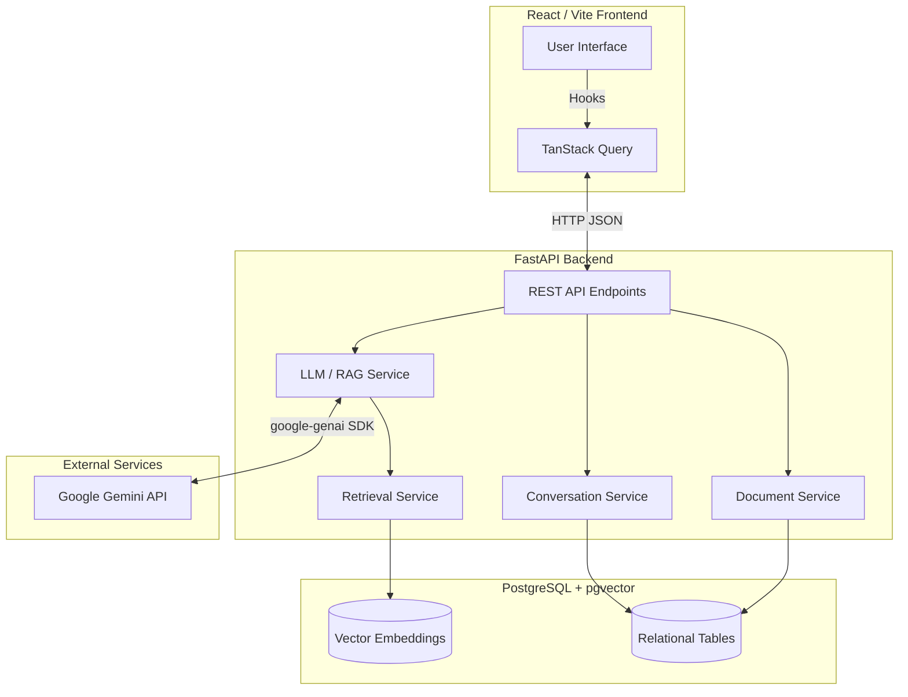
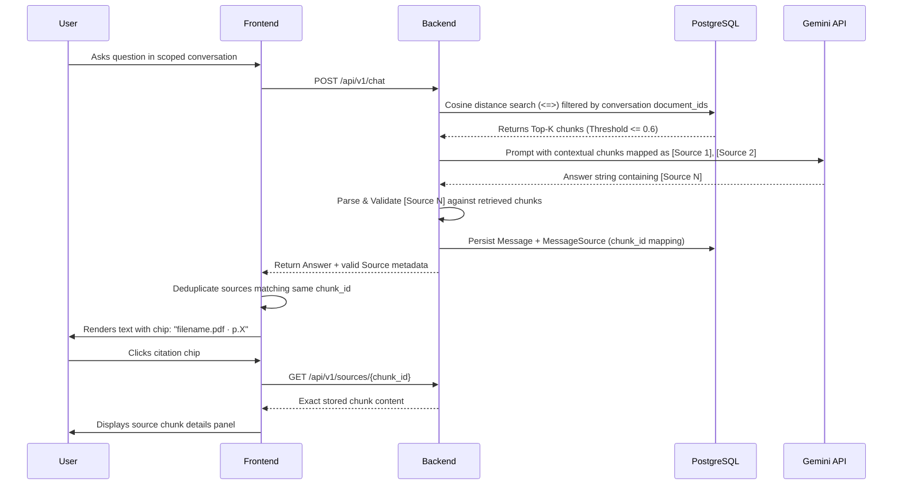

# System Design Document

## 1. Architecture Overview

The AI Document Q&A system is designed as a modern, containerized full-stack application built upon a custom RAG (Retrieval-Augmented Generation) pipeline. It explicitly avoids heavy orchestration frameworks like LangChain, LlamaIndex, or Haystack in favor of a lean, custom, and transparent implementation.

### System Architecture Diagram



### Technology Stack
- **Frontend**: React 19, TypeScript, Vite, TailwindCSS, TanStack Query.
- **Backend**: Python 3.11, FastAPI, SQLAlchemy (async), asyncpg, Alembic, PyMuPDF.
- **AI Integration**: `google-genai` SDK using exclusively Google Gemini models.
  - *Embedding*: `gemini-embedding-001` (1536 output dimensions)
  - *Generation*: `gemini-3.5-flash` (Primary), `gemini-3.5-flash-lite`, `gemini-3.7-flash` (Fallback conditions include provider/model availability failures such as HTTP 429, 503, and 404).
- **Database**: PostgreSQL with the `pgvector` extension.

---

## 2. RAG Pipeline and Document Chunking

### Document Extraction
- PyMuPDF performs standard text extraction.
- **OCR Fallback**: If a page yields insufficient text (e.g. scanned/image-only PDFs), the system automatically invokes PyMuPDF's built-in Tesseract-backed OCR (`get_textpage_ocr`).
- The OCR text retains the original `page_number` and drops transparently into the normal chunking and embedding pipeline. No parallel pipeline is needed.

### Chunking Implementation
The system employs **custom word-boundary sliding-window chunking with configurable chunk size and overlap, strictly bounded to individual PDF pages**.
- **Default chunk size**: 1000 characters
- **Default overlap**: 200 characters
- **Behavior**: It preserves `page_number` inherently and guarantees **no cross-page chunks**. The process yields a deterministic `chunk_index` for every block of text parsed by PyMuPDF.

### Presentation Layer
Gemini responses are rendered using `react-markdown` to provide formatting (bold, lists, tables).
The backend's source extraction logic passes validated metadata to the frontend. The frontend parses raw `[Source N]` tags, transforms them into controlled markdown components (e.g. `[Source N](source://N)`), and dynamically overrides the React Markdown anchor renderer to inject the custom interactive citation chips without breaking standard Markdown features.

### RAG and Citation Flow

The citation architecture provides verifiable groundedness by linking the LLM's generated source markers back to the exact database chunks, all the way to the frontend UI.



---

## 3. Database Schema

The database model is built with SQLAlchemy and utilizes `ON DELETE CASCADE` across all foreign keys to guarantee clean removal of assets.

- **`documents`**: Tracks uploaded files (`id`, `filename`, `file_size`, `page_count`, `processing_status`).
- **`document_chunks`**: Houses the extracted chunks (`id`, `document_id`, `page_number`, `chunk_index`, `content`) and the 1536-dimensional `embedding` using pgvector's `Vector(1536)`.
- **`conversations`**: Represents a chat session (`id`, `title`).
- **`conversation_documents`**: A mapping table isolating which `document_id`s are accessible in a specific `conversation_id`.
- **`messages`**: Chat turn history (`id`, `conversation_id`, `role`, `content`).
- **`message_sources`**: Maps individual messages to specific document chunks to persist citation metadata per-message (`message_id`, `source_number`, `chunk_id`, `document_id`, `filename`, `page_number`, `chunk_index`).

---

## 4. API Endpoints Reference

### Document Upload
- **`POST /api/v1/documents/upload`**
- **Input**: `multipart/form-data` containing the PDF file.
- **Output**: 
  ```json
  { "id": "uuid", "filename": "example.pdf", "processing_status": "UPLOADED" }
  ```

### Document Deletion
- **`DELETE /api/v1/documents/{document_id}`**
- Cascades deletion through `document_chunks` and `conversation_documents`.

### Conversation Creation
- **`POST /api/v1/conversations`**
- **Input**:
  ```json
  { "document_ids": ["uuid-1", "uuid-2"] }
  ```
- **Output**:
  ```json
  { "id": "conv-uuid", "title": "New Conversation", "document_ids": ["uuid-1", "uuid-2"], "created_at": "..." }
  ```

### Conversation History
- **`GET /api/v1/conversations/{conversation_id}`**
- **Output**: Returns the conversation details, heavily eager-loading `messages` and their related `sources`.
  ```json
  {
    "id": "conv-uuid",
    "document_ids": ["uuid-1"],
    "messages": [
      {
        "id": "msg-uuid",
        "role": "assistant",
        "content": "The answer is X [Source 1].",
        "sources": [
          { "source_number": 1, "chunk_id": "chunk-uuid", "filename": "doc.pdf", "page_number": 2, "chunk_index": 0 }
        ]
      }
    ]
  }
  ```

### Chat
- **`POST /api/v1/chat`**
- **Input**:
  ```json
  { "conversation_id": "conv-uuid", "message": "What is the CGPA?" }
  ```
- **Output**:
  ```json
  {
    "answer": "The CGPA is 8.92 [Source 1].",
    "sources": [
      { "source_number": 1, "chunk_id": "chunk-uuid", "filename": "Resume.pdf", "page_number": 1, "chunk_index": 3 }
    ]
  }
  ```

### Source Inspection
- **`GET /api/v1/sources/{chunk_id}`**
- **Output**:
  ```json
  {
    "id": "chunk-uuid",
    "document_id": "doc-uuid",
    "page_number": 1,
    "chunk_index": 3,
    "content": "... exact text of the chunk ...",
    "filename": "Resume.pdf"
  }
  ```

### Conversation Deletion
- **`DELETE /api/v1/conversations/{conversation_id}`**
- Cascades deletion through `messages`, `message_sources`, and `conversation_documents`.
